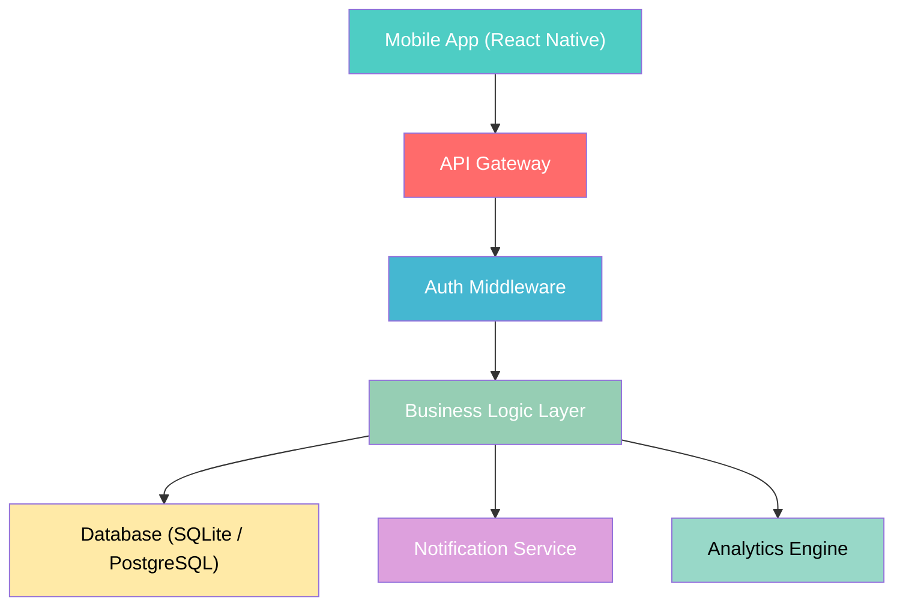
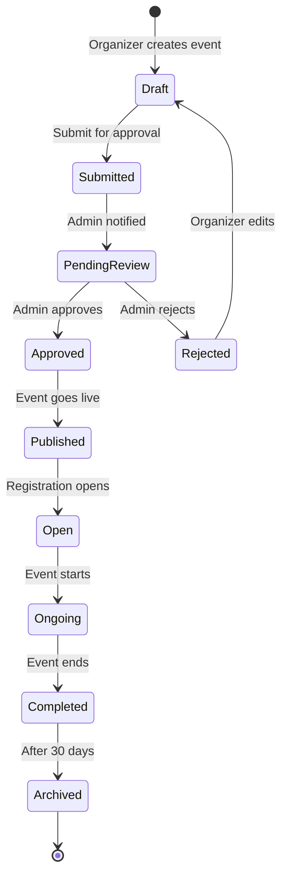
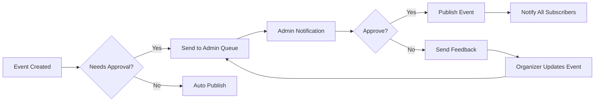
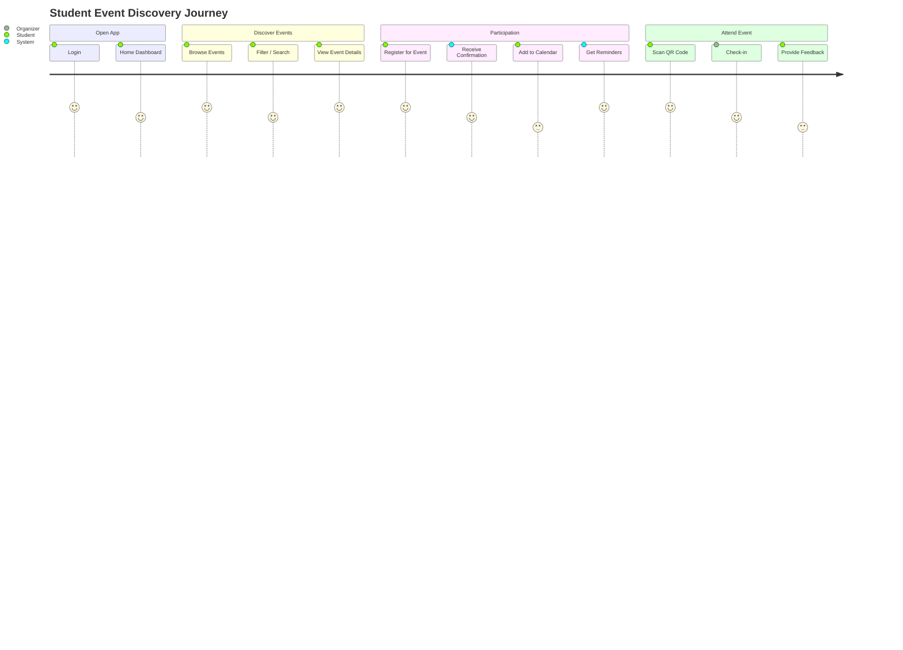
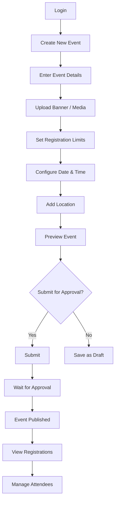
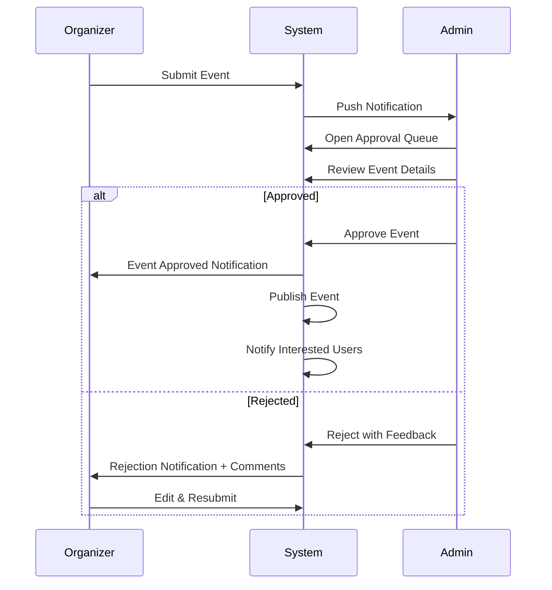
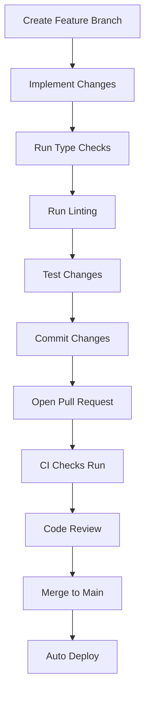
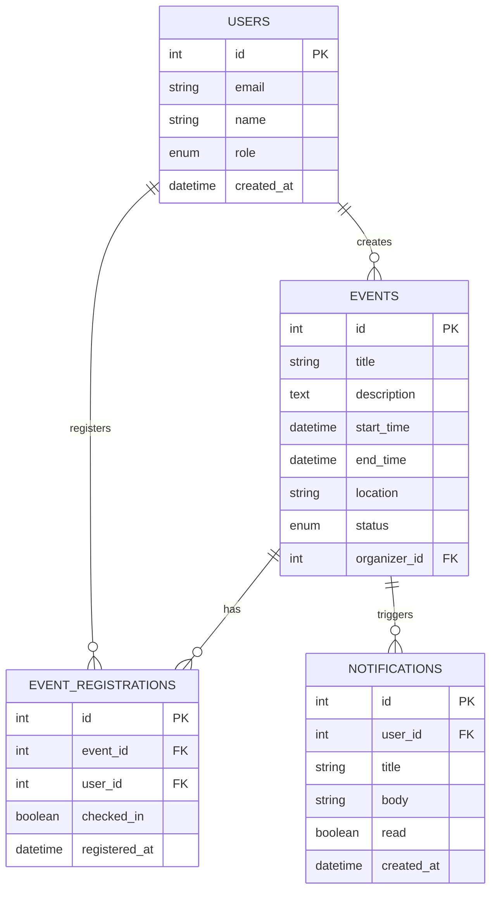
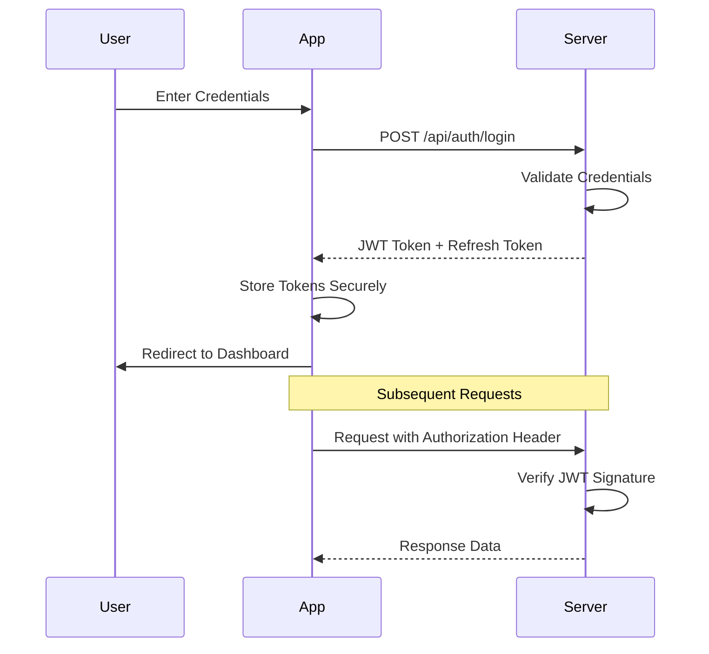

# CampusSphere

> **Next-Generation Campus Event Management Platform**
>
> A modern, full-stack event management system designed specifically for college campuses, enabling seamless event creation, approval workflows, attendee tracking, and real-time notifications.

---

## 📋 Project Overview

CampusSphere is a monorepo containing:
- ✅ Cross-platform mobile application (React Native / Expo)
- ✅ Backend REST API server (Node.js / Express)
- ✅ Shared type definitions & validation schemas
- ✅ Database layer with Drizzle ORM
- ✅ Auto-generated API clients
- ✅ UI component sandbox & design system

---

## 🏗️ System Architecture



---

## 🚀 Core Features

| User Role         | Capabilities                                                                 |
|-------------------|-----------------------------------------------------------------------------|
| **Student**       | Browse events, register, view calendar, receive notifications, scan QR     |
| **Event Organizer**| Create events, manage attendees, view analytics, send updates              |
| **Admin**         | Approve events, manage users, platform analytics, system configuration     |
| **Guest**         | View public events, login / sign up                                         |

---

## 🔄 Workflow Diagrams

### Event Lifecycle Workflow



### Approval Workflow



---

## 👤 User Flows

### Student User Flow



### Organizer Event Creation Flow



### Admin Moderation Flow



---

## 🛠️ Technology Stack

| Layer               | Technologies                                                                 |
|---------------------|-----------------------------------------------------------------------------|
| **Mobile Frontend** | React Native, Expo Router, TypeScript, Tamagui, React Query                 |
| **Backend**         | Node.js, Express.js, Zod, Winston Logger                                    |
| **Database**        | Drizzle ORM, SQLite (dev) / PostgreSQL (prod)                               |
| **API**             | OpenAPI 3.0, Orval Code Generation, tRPC patterns                           |
| **Tooling**         | PNPM Workspaces, Turborepo, ESLint, Prettier, TypeScript                    |
| **Dev Tools**       | Mockup Sandbox, Storybook, Hot Reload                                       |

---

## 📦 Repository Structure

```
CampusSphere/
├── artifacts/
│   ├── api-server/              # Backend API Server
│   ├── campus-events/           # React Native Mobile App
│   └── mockup-sandbox/          # UI Component Playground
├── lib/
│   ├── api-spec/                # OpenAPI Specification
│   ├── api-client-react/        # Generated React API Client
│   ├── api-zod/                 # Zod Validation Schemas
│   └── db/                      # Database Schema & Client
├── scripts/                      # Utility Scripts
└── package.json
```

---

## ⚙️ Installation & Setup

### Prerequisites
- Node.js 20+
- PNPM 8+
- Expo CLI
- iOS Simulator / Android Emulator (for mobile development)

### Quick Start

```bash
# 1. Clone repository
git clone https://github.com/SairajMN/CampusSphere.git
cd CampusSphere

# 2. Install dependencies
pnpm install

# 3. Build all packages
pnpm build

# 4. Start development servers
pnpm dev
```

### Individual Workspaces

```bash
# Start API Server
pnpm dev:api

# Start Mobile App
pnpm dev:app

# Start Component Sandbox
pnpm dev:sandbox
```

---

## 🧪 Development Workflow



---

## 📊 Database Schema Overview



---

## 🔐 Authentication Flow



---

## 🤝 Contributing

1. Fork the repository
2. Create your feature branch (`git checkout -b feature/amazing-feature`)
3. Commit your changes (`git commit -m 'Add some amazing feature'`)
4. Push to the branch (`git push origin feature/amazing-feature`)
5. Open a Pull Request

---

## 📄 License

This project is licensed under the MIT License - see the LICENSE file for details.

---

## ⭐ Support

For support, email campussphere@example.com or open an issue in the repository.

---

<div align="center">
<sub>Built with ❤️ by MCA Devs Team</sub>
</div>